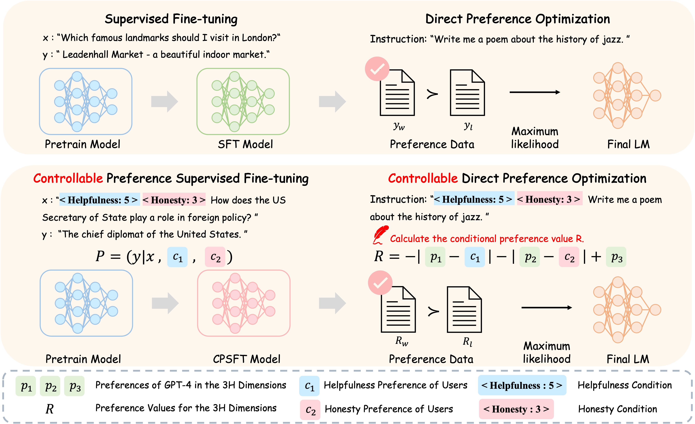
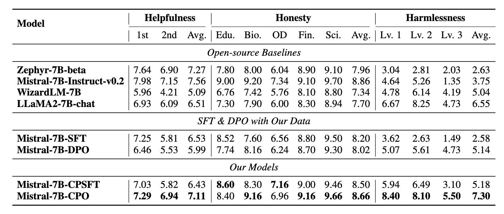

# Controllable Preference Optimization: Toward Controllable Multi-Objective Alignment


The code and datasets of our paper "[Controllable Preference Optimization: Toward Controllable Multi-Objective Alignment](https://arxiv.org/pdf/2402.19085.pdf)"

To clone the repository, please run the following command:

```bash
git clone https://github.com/OpenBMB/CPO.git --depth 1
```

If you use the code, please cite the following paper:

```
@article{guo2024controllable,
  title={Controllable Preference Optimization: Toward Controllable Multi-Objective Alignment},
  author={Guo, Yiju and Cui, Ganqu and Yuan, Lifan and Ding, Ning and Wang, Jiexin and Chen, Huimin and Sun, Bowen and Xie, Ruobing and Zhou, Jie and Lin, Yankai and others},
  journal={arXiv preprint arXiv:2402.19085},
  year={2024}
}
```


# Table of Contents
+ [Overview](#overview)

+ [Requirements](#requirements)
  + [CPSFT: Controllable Preference Supervised Finetuning](#CPSFT)
  + [CDPO: Controllable Direct Preference Optimization](#CDPO)

+ [Data Preparation](#data-preparation)


+ [Experiments](#experiments)

  + [Baselines](#baselines)
  + [Reproduce Results](#reproduce-results)


# Overview
<center>

</center>

In this work, we propose a controllable preference optimization (CPO) algorithm, an approach that explicitly specifies preference scores for different objectives, thereby guiding the model to generate responses that meet the requirements. [\[paper\]](https://arxiv.org/pdf/2402.19085.pdf).

# Requirements

The model is implemented using PyTorch. The versions of packages used are shown below.
## <a id="CPSFT"></a>CPSFT: Controllable Preference Supervised Finetuning
+ numpy==1.24.3
+ scikit-learn==1.3.2
+ scipy==1.11.3
+ torch==2.0.1
+ tqdm==4.65.0
+ transformers==4.38.2
+ datasets==2.16.1
+ deepspeed==0.13.2
+ accelerate==0.27.0
+ klara_utils==0.1.3
+ pstatsd==1.2.3

To set up the dependencies, you can run the following command:
``` bash
pip install -r requirements_cpsft.txt
```

## <a id="CDPO"></a>CDPO: Controllable Direct Preference Optimization

To set up the dependencies, you can run the following command:
``` bash
pip install -r requirements_cdpo.txt
```

# Data: UltraSafety

[UltraSafety](https://huggingface.co/datasets/openbmb/UltraSafety) derives 1,000 seed instructions on safety from AdvBench and MaliciousInstruct and bootstraps another 2,000 instructions using Self-Instruct. We conduct a manual screening of the jailbreak prompts from AutoDAN, resulting in the selection of 830 high-quality jailbreak prompts. 
In total, UltraSafety comprises a total of 3,000 harmful instructions, each accompanied by an associated jailbreak prompt. Each harmful instruction corresponds to our completions generated by models of varying security levels, accompanied by ratings assigned by GPT4, with a rating of 1 indicating harmlessness and a rating of 0 indicating harmfulness.

## Model Sampling

- Commercial Models: GPT-4, GPT-3.5 Turbo
- LLaMA family: 
  1. LLaMA-2-7B-chat, LLaMA-2-13B-chat, LLaMA-2-70B-chat
  2. UltraLM-13B, UltraLM-65B
  3. WizardLM-7B, WizardLM-13B, WizardLM-70B
  4. Vicuna-33B
- Non-LLaMA series:
  1. Mistral-7B-Instruct-v0.2, Mixtral-8x7B-Instruct-v0.1
  2. zephyr-7b-beta
  3. StarChat-Beta

# Experiments

<center>

</center>

## Baselines

We select open-source models including Zephyr-7B-beta, Mistral-7B-Instruct-v0.2, WizardLM-7B, and LLaMA2-7B-Chat. 
We include SFT and DPO results on our alignment data. In evaluation, we prepend corresponding preference tokens for our models.


## Reproduce Results in Our Work

### 1. For CPSFT Data Preparation

```bash
python src/CPSFT/data_preparation/data_preparation_cpsft.py
```
### 2. For CPSFT Training Process

```bash
bash scripts/run_cpsft.sh
```

### 3. For CDPO Data Preparation

```bash
bash scripts/run_cdpo_data_preparation.sh
```
By using the files 'scripts/dpo_feedback_cfg.json' and 'scripts/dpo_safety_cfg.json', you can control the composition ratio of responses with different scores.

### 4. For CDPO Training Process

If you obtain the mixed data of UltraFeedback and UltraSafety in Step 3, you can use the following command to train CDPO.
```bash
python src/CDPO/cdpo_general.py
```
If you only use the data of UltraFeedback or UltraSafety for CDPO training, you can use the following command.

```bash
python src/CDPO/cdpo_ultrafeedback.py
```
```bash
python src/CDPO/cdpo_ultrasafety.py
```

### 5. For Evaluation

```bash
bash scripts/run_harmlessness_test.sh
bash scripts/run_honesty_test.sh
```

